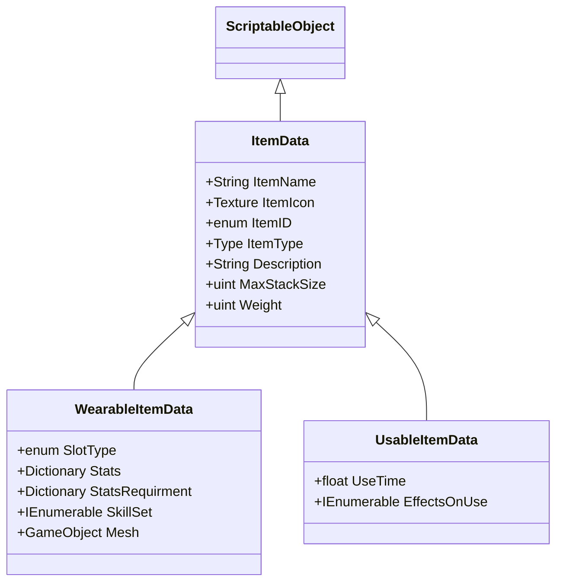

# Multiplayer RPG Prototype Design DOC

## Główny opis projektu

P-MRPG - jest prototypem gry sieciowej z elementami rozgrywki role play game, posiadająca duży nacisk na średnio-szybką rozgrywkę. Dużym wyzwaniem jest stworzenie grywalnego prototypu w przeciągu paru miesięcy, równocześnie implementując nowoczesne techniki sieciowe, które można znaleźć w grach. Projekt czerpie parę inspiracji z innych gier sieciowych, które zostały sprawdzone na rynku. Nie ukrywam jest to dosyć duże wyzwanie, które chce się podjąć, rozwijając przy tym kompetencje. Większość użytych narzędzi jest oparte o silnik do tworzenia gier Unity 3D, który jest dojrzałym rozwiązaniem, lecz dodaję parę komplikacji dla gier sieciowych. Jedną z wad jest silnik fizyczny, który nie jest deterministyczny, więc nie można w prosty sposób uzyskać idealnej synchronizacji tych samych obliczeń na dwóch różnych urządzeniach. Drugą wadą, którą mogę wymienić jest brak dostępu do kodu źródłowego i w wypadku wystąpienia błędu w silniku, deweloper musi znaleźć inne rozwiązanie. Przy rozwijaniu tego projektu, nie będę tworzył nowej technologii sieciowej ze względu na małą ilość czasu, dodatkowo tworzenie biblioteki sieciowej od początku jest wyzwaniem na miarę doktoratu. Zostanie użyte rozwiązanie pod nazwą FishNet, które umożliwia wysokopoziomową komunikację przez sieć między dwoma aplikacjami wykorzystując różne metodyki w architekturze client - serwer. Autorytet symulacji jest przejęty w pełni przez serwer, eliminuje to w pewnym zakresie możliwość oszustw. Poniżej są opisane w dużym skrócie elementy gry oraz rozwiązania, które zostaną w pewnym stopniu zaimplementowane do gry.

Przewiduję dostarczać co tydzień progres w formie rozmowy video, albo wysyłając film prezentacyjny.

## Przewidywane technologie

Silnik do tworzenia gier: **Unity3D**
Biblioteka sieciowa: **FishNet + warstwa transportowa wykorzystująca protokół UDP**
Dodatkowe rozwiązania użyte w Unity, na które posiadam licencje: **Easy Character Controller 2** (Narzędzie do tworzenia poruszania się postaci),  **Parrel Sync** (Pozwala na uruchomienie dwóch tych samych projektów jednocześnie, Unity bezpośrednio nie umożliwia tego)
Assety dodatkowe(Muzyka, modele 3D/2D, UI): Wypiszę podczas w pracy inżynierskiej. Na ten moment nie wiem jeszcze czego użyję.
Kontrola wersji: **Git na serwerze Github**
Systemy operacyjne: **Client** - Windows 10/11, **Server** - Linux, prawdopodobnie Debian w najnowszej wersji. 
Środowisko backendowe: **Asp.net core** lub **NodeJS**
Bazy danych: **Fauna**
CI/CD: **Github Actions**

**Jeśli chodzi o technologie webowe [Środowisko backendowe, bazy danych] zostaną użyte tylko kiedy starczy mi czasu na implementacje logowania/rejestracji  i zapisywaniu stanu gry do bazy danych. Te systemy będą dodawane na samym końcu.**
 
## Model sieciowy
Podczas wykonywania tego prototypu jest wykorzystywany model sieciowy client-serwer. Przy tym modelu jedno urządzenie posiada role serwera i komunikuje się między innymi użytkownikami. Bezpośrednia komunikacja między użytkownikami nie jest możliwa i musi zostać przekazana/wykonywana poprzez serwer. Rozwijając ten koncept, można dodać notkę, że serwer jest jedynym źródłem prawdy w symulacji i to on zarządza rozgrywką. Inni klienci są jedynie "głupimi kukłami", które są odpowiedzialne tylko i wyłącznie za warstwę audio-wizualną. 

## Problemy gier sieciowych oraz techniki synchronizacji
Największym wrogiem gier sieciowych jest opóźnienie, które wpływa na odbiór i imersje w grze. Niestety jesteśmy ograniczeni prędkością światła, która wpływa na opóźnienie. Na przykład można wziąć połączenie dwóch urządzeń, gdzie jedno jest w Polsce, a drugie w Japonii. Przy takim połączeniu opóźnienie wynosi mniej więcej $300 ms$. Może się wydawać nie jest to dużo ale przy szybszych rozgrywkach np. Counter Strike gdzie gracz musiałby czekać na odpowiedź serwera $300ms$ rozgrywka byłaby niegrywalna z perspektywy gracza.

W standardzie gier sieciowych można wyróżnić dwie techniki synchronizacji, które są używane przy produkcji.

### Deterministic Lockstep
Deterministic Lockstep w teorii jest jednym z najprostszych technik w implementacji przy grach sieciowych.
Jedynym wymogiem, które trzeba spełnić jest pełny determinizm w symulacji. Czyli każda wykonana akcja musi mieć taki sam wynik na wszystkich urządzeniach. Dla przykładu może być ruch gracza, który na samym początku posiada pozycję w przestrzeni dwuwymiarowej $[x = 0.0, y = 0.0]$. Poruszając nim o dwie jednostki w górę(na osi $y$) powinien być w pozycji $[x = 0.0, y = 2.0]. W wymianie sieciowej przesyłane są tylko pakiety posiadające tylko i wyłącznie dane wejściowe. Przy ruchu gracza może to być stan klawisza "W" na klawiaturze. Posiadając taką informacje to każde inne urządzenie może zasymulować ruch i otrzymać idealny wynik. Główną zaletą tego rozwiązania jest relatywnie bardzo mały ruch sieciowy, który umożliwia nam synchronizację większej ilość obiektów w grze przy małej ilości wykorzystywanego łącza. Głównym problemem przy tym rozwiązaniu jest opóźnienie sieciowe, przy większym opóźnieniu rozgrywka nie jest już taka płynna jaka powinna się wydawać. Podczas symulacji reszta graczy musi "czekać", aż reszta wykona wszystkie akcje, które otrzymała wcześniej. Nawet jeden gracz z wysokim opóźnieniem może wpływać negatywnie na rozgrywkę.  Drugim problemem jest determinizm, ponieważ większość silników fizycznych wykorzystuje liczby zmiennoprzecinkowe, gdzie przy użytku tych liczb występuje błąd maszynowy. Nawet jeśli dany błąd wynosi $\epsilon$ to przy częstotliwości wykonywanych obliczeń $30Hz$ po pewnym czasie wystąpi desynchronizacja, która nie jest dopuszczalna przy tym rozwiązaniu.

### State synchronization

State synchronization są wysyłąne pakiety między urządzeniami zawierające stan danego obiektu. Dla przykładu można założyć jest to rotacja oraz pozycja w świecie gry. Większość symulacji jest wykonywana przez serwer i to serwer przesyła stan do innych urządzeń. W przypadku tej techniki, gracz nie musi czekać na reakcję innych. Nawet jeśli parę pakietów nie dotrze, to rozgrywka jest dalej kontynuowana. Generuję to szereg problemów wizualnych oraz technicznych. Przy częstotliwość $30Hz$ aplikując dane wartości do obiektu, nie będzie wyglądała na płynną. Sama symulacja będzie zużywała dużą ilość łącza. Dajmy na to, że chcemy synchronizować 40 obiektów posiadających pozycję oraz rotację. Pozycję można zapisać w formie wektora posiadającego trzy wartości $[X,Y,Z]$, używając przy tym liczby zmiennoprzecinkowe, które zajmują 4 byte'y w pamięci. Rotacja w większości gier jest zapisana w postaci kwaterionu, który posiada cztery komponenty $[X,Y,Z,W]$, każdy z nich zajmuje również 4 byte'y w pamięci. Sumarycznie jeden pakiet ze stanem będzie zajmował 28 byte'ów pamięci. Przy częstotliwości przesyłania danych $30Hz$ dla 40 obiektów ilość danych wyniesie 33 600 bytów wysłanych przeciągu jednej sekundy. Niby nie wygląda to na dużą ilość, ale dodając do tego np. prędkość obiektów i inne zmienne, ilość danych diametralnie się zwiększy. Przy czym będzie to generowały większe koszty utrzymania serwera. Jednak symulacja nie musi być deterministyczna i będzie działała na większości urządzeń dostępnych na rynku. Wady wymienione powyżej można zniwelować albo ukryć stosując różne algorytmy i techniki.

**Przy użytku silnika Unity3D, gdzie jego silnik fizyczny nie jest deterministyczny w prototypie jest użyta technika synchornizacji stanów**

## Krótki opis mapy świata
Mapa prototypu będzie dosyć mała, ale otwarta. Czyli gracz będzie mógł wejść praktycznie wszędzie bez większych ograniczeń. Całkiem możliwe, że nie będzie posiadała wyszukanych assetów i większość świata zostanie przedstawiona za pomocą prostych kształtów. W głównej mierze mapa ma służyć do przetestowania zaimplementowanych mechanik.
## Opis mechanik

### Poruszanie się postaci oraz perspektywa kamery
Poruszanie się postacią jest pierwszy elementem, z którym gracz będzie miał styczność. Powinno być płynne i przyjemne dla gracza, więc musi zostać dopieszczone od A do Z. Jest to element, gdzie na samym początku głównie się skupię podczas tworzenia tego prototypu. Gracz będzie wykorzystywał klawiszologie podobną do innych gier. Czyli poruszanie się horyzontalnie i wertykalnie za pomocą klawiszy na klawiaturze [W,S,A,D], a rotacja zostanie wykonana za pomocą wskaźnika myszki. Prototyp umożliwi również skok oraz wchodzenie bezpośrednio na różne równie pochyłe i małe przeszkody.

**Perspektywa top down view**

### Interakcje między obiektami
W prototypie przewiduję parę możliwości interakcja między obiektami. Głównymi odbiorcami jest gracz i różne przystosowane do tego obiekty. Przy interakcja między graczem a obiektem jest widoczne opóźnienie sieciowe. Większość gier sieciowych nie stosuje przy tym żadnej techniki ukrycia opóźnienia.

Interakcja gracz -> gracz: są tylko wypadku kiedy między graczami wystąpi kolizja. Za pomocą fizyki inny gracz będzie mógł przesuwać innego gracza, lub go odpychać za pomocą ataku.

"Stopy" gracza -> obiekt w świecie gry. Może to być płytka naciskowa albo teleport. Interakcja zajdzie tylko wtedy kiedy gracz wejdzie na dany obiekt

Gracz -> przedmiot w zasięgu. Są to inne obiekty na które możemy "kliknąć". Idealnym przykładem są drzwi, które chcemy otworzyć.  Gracz będzie mógł je otworzyć tylko wtedy kiedy będzie w zasięgu akcji.

Dany obiekt interakcyjny może być użyty tylko przez jeden system wykrywający interakcje. Czyli płytka naciskowa nie może zostać użyta jednocześnie w relacji stopy gracza -> obiekt i gracz -> obiekt. Filtrowanie można uzyskać za pomocą flag bitowych.

### Przedmioty, ekwipunek oraz kontenery na przedmioty
Przedmioty są podzielone na różne kategorię użytkowe, ale każda kategoria dziedziczy po kategorii pierwotnej. 
Kategoria pierwotna posiada odpowiednie dane takie jak: nazwa przedmiotu, waga, ikona, oraz inne potrzebne statystyki.
Inne kategorie będą tworzone w razie potrzeby innych funkcjonalności.

Przykładowa hierarchia przedmiotów:

**Jest to przykładowy diagram klas dla przedmiotów**

**Kontener na przedmioty**: jest prostym interfejsem, który obsługuję akcje związane z przedmiotami. Takie jak dodawanie nowych przedmiotów, usuwanie przedmiotów, zamiana miejscami między przedmiotami. 

**Ekwipunek**: składa się z miejsc, gdzie dany przedmiot możemy założyć oraz kontenera na przedmioty. Zakładając dany przedmiot, serwer przyznaje statystyki graczowi oraz zmienia jego wygląd.

Przy tym systemie można użyć wzorzec MVC, gdzie modelem są przedmioty, widokiem jest UI oraz kontroler, który jest obsługiwany przez kontener na przedmioty i ekwipunek.

Przykładowy widok inventory
### Statystyki
System statystyk jest zwarty bezpośrednio z graczem gdzie można zapisać przeróżne statystyki. Od ilości życia gracza po jego prędkość czy wagę wpływająca na jego ruch. Przy dynamicznych statystykach można zastosować symulacje po stronie klienta, gdzie klient jest w stanie przewidzieć ile dana statystyka będzie wynosić w danym czasie w przyszłości. Jeśli dane nie będą się zgadzać to statystyka zostanie przywrócona z odpowiedzi od serwera. To wymusza na zastosowanie dwóch różnych kopii, jedną za która jest odpowiedzialny serwer, oraz kopie wizualna za która jest odpowiedzialny klient.

### Dynamiczny system walki bronią biała i dystansową
System walki przewiduję, że będzie dosyć prosty w kontekście designu gry. Walkę można podzielić na różne rodzaje broni, które są używane przez gracza. Na ten moment przewiduje walkę bronią białą z podziałem na jednoręczną, dwuręczną, jednoręczna + tarcza oraz bronie dystansowe typu łuk i kusza. Każdy rodzaj walki posiada swój zestaw animacji, który jest synchronizowany przez sieć.
Walkę gracz rozpoczyna przez naciśnięcie lewego bądź prawego przycisku myszy, gdzie prawy jest odpowiedzialny za blokowanie. Większym wyzwaniem będzie zaimplementowanie strzelania za pomocą broni dystansowej i synchronizowanie pocisków przez sieć. 
### System umiejętności
Gracz będzie miał możliwość wyboru różnych umiejętności podczas rozgrywki, całkiem możliwe, że umiejętności będą również dodawane przez założenie jakiegoś przedmiotu. Zasada działania będzie podobna do walki wręcz, czy walki dystansowej ale z dodatkiem różnych efektów wizualnych. Umiejętności mogą być różne, np. leczenie swojego zdrowia czy odepchnięcie przeciwnego gracza.
### Proste postacie niezależne

**Opis systemów będzie bardziej rozpisany w trakcie pisania pracy inżynierskiej. Każdy system zostanie dokładnie rozpisany wliczając w to opis techniczny.**

## Opis mechanik jeśli starczy czasu dodanie ich do gry
**Poniższe mechaniki zostaną rozpisane jeśli starczy czasu na ich implementacje**

### Wygląd postaci i wpływ przedmiotów na wygląd
### Logowanie i rejestracja konta
### Tworzenie postaci
### Zapis stanu rozgrywki [Statystyki, ekwipunek, pozycja gracza, stan]
### Handlarze
### Synchronizacja na podstawie drzewa ósemkowego

## Inspiracje

Gry na których się inspiruje w trakcie tworzenia prototypu:
> Tibia - Świat gry i jego otwartość
> V-Rising - Perspektywa widoku
> Battlerite - System walki
> Warhammer: Vermintide 2 - Blokowanie ataków 
> The Legend of Zelda: Breath of the Wild - Wygląd interfejsu użytkownika